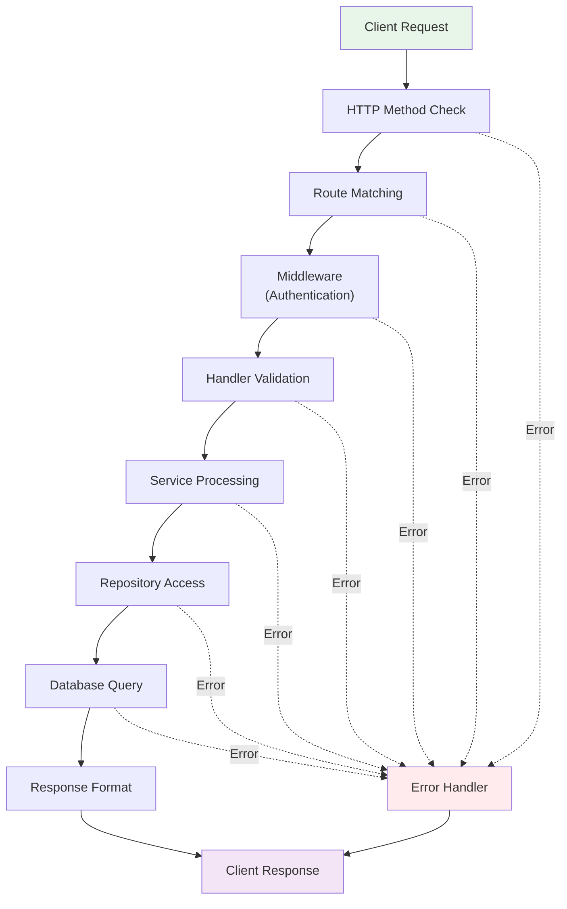

# API Documentation

Complete reference for all Service Order API endpoints.

## Overview

The Service Order API provides RESTful endpoints for managing:

- Persons (customers/service providers)
- Contacts (communication information)
- Orders (service orders)
- Tasks (work items)
- Transactions (financial records)
- Detail Tasks (task details)

## Base URL

```
http://localhost:8080
```

For production, replace localhost:8080 with your server address.

## Authentication

All endpoints (except /health) require authentication via bearer token.

### Header Format

```http
Authorization: Bearer YOUR_API_TOKEN
```

Include this header in all API requests.

---

## Health Check

### Endpoint

GET /health

### Description

Check if the API server is running and healthy.

### Authentication

Not required

### Request Example

```bash
curl http://localhost:8080/health
```

### Response

```
Status: 200 OK
Body: ok
```

### Use Cases

- Monitoring and uptime checks
- Load balancer health probes
- Dependency verification

---

## Persons API

Manage person records (customers, service providers, etc.).

### Create Person

POST /persons

Creates a new person record.

#### Request Body

```json
{
  "firstname": "John",
  "middlename": "Michael",
  "lastname": "Doe"
}
```

#### Parameters

| Name       | Type   | Required | Description        |
| ---------- | ------ | -------- | ------------------ |
| firstname  | string | Yes      | Person first name  |
| middlename | string | No       | Person middle name |
| lastname   | string | No       | Person last name   |

#### Example

```bash
curl -X POST http://localhost:8080/persons \
  -H "Content-Type: application/json" \
  -H "Authorization: Bearer YOUR_TOKEN" \
  -d '{
    "firstname": "John",
    "middlename": "Michael",
    "lastname": "Doe"
  }'
```

#### Response

```json
{
  "id": 1,
  "firstname": "John",
  "middlename": "Michael",
  "lastname": "Doe",
  "created_at": "2026-05-29T11:50:32Z"
}
```

#### Status Codes

- 201 Created - Person successfully created
- 400 Bad Request - Invalid request body
- 401 Unauthorized - Missing or invalid authentication
- 500 Internal Server Error - Server error

---

### List Persons

GET /persons

Retrieve all persons.

#### Query Parameters

Currently, no filtering parameters are supported. All persons are returned.

#### Example

```bash
curl http://localhost:8080/persons \
  -H "Authorization: Bearer YOUR_TOKEN"
```

#### Response

```json
[
  {
    "id": 1,
    "firstname": "John",
    "middlename": "Michael",
    "lastname": "Doe",
    "created_at": "2026-05-29T11:50:32Z"
  },
  {
    "id": 2,
    "firstname": "Jane",
    "middlename": null,
    "lastname": "Smith",
    "created_at": "2026-05-29T12:00:00Z"
  }
]
```

#### Status Codes

- 200 OK - Successfully retrieved
- 401 Unauthorized - Missing or invalid authentication
- 500 Internal Server Error - Server error

---

### Get Person by ID

GET /persons/{id}

Retrieve a specific person by ID.

#### Path Parameters

| Name | Type    | Description |
| ---- | ------- | ----------- |
| id   | integer | Person ID   |

#### Example

```bash
curl http://localhost:8080/persons/1 \
  -H "Authorization: Bearer YOUR_TOKEN"
```

#### Response

```json
{
  "id": 1,
  "firstname": "John",
  "middlename": "Michael",
  "lastname": "Doe",
  "created_at": "2026-05-29T11:50:32Z"
}
```

#### Status Codes

- 200 OK - Successfully retrieved
- 401 Unauthorized - Missing or invalid authentication
- 404 Not Found - Person not found
- 500 Internal Server Error - Server error

---

### Replace Person (PUT)

PUT /persons/{id}

Replace an entire person record.

#### Path Parameters

| Name | Type    | Description |
| ---- | ------- | ----------- |
| id   | integer | Person ID   |

#### Request Body

```json
{
  "firstname": "Jane",
  "middlename": null,
  "lastname": "Smith"
}
```

#### Example

```bash
curl -X PUT http://localhost:8080/persons/1 \
  -H "Content-Type: application/json" \
  -H "Authorization: Bearer YOUR_TOKEN" \
  -d '{
    "firstname": "Jane",
    "middlename": null,
    "lastname": "Smith"
  }'
```

#### Response

```json
{
  "id": 1,
  "firstname": "Jane",
  "middlename": null,
  "lastname": "Smith",
  "created_at": "2026-05-29T11:50:32Z"
}
```

#### Status Codes

- 200 OK - Successfully updated
- 400 Bad Request - Invalid request body
- 401 Unauthorized - Missing or invalid authentication
- 404 Not Found - Person not found
- 500 Internal Server Error - Server error

---

### Update Person (PATCH)

PATCH /persons/{id}

Update specific fields of a person record (partial update).

#### Path Parameters

| Name | Type    | Description |
| ---- | ------- | ----------- |
| id   | integer | Person ID   |

#### Request Body

Only include fields you want to update:

```json
{
  "lastname": "Smith"
}
```

#### Example

```bash
curl -X PATCH http://localhost:8080/persons/1 \
  -H "Content-Type: application/json" \
  -H "Authorization: Bearer YOUR_TOKEN" \
  -d '{
    "lastname": "Smith"
  }'
```

#### Response

```json
{
  "id": 1,
  "firstname": "John",
  "middlename": "Michael",
  "lastname": "Smith",
  "created_at": "2026-05-29T11:50:32Z"
}
```

#### Status Codes

- 200 OK - Successfully updated
- 400 Bad Request - Invalid request body
- 401 Unauthorized - Missing or invalid authentication
- 404 Not Found - Person not found
- 500 Internal Server Error - Server error

---

### Delete Person

DELETE /persons/{id}

Delete a person record.

#### Path Parameters

| Name | Type    | Description |
| ---- | ------- | ----------- |
| id   | integer | Person ID   |

#### Example

```bash
curl -X DELETE http://localhost:8080/persons/1 \
  -H "Authorization: Bearer YOUR_TOKEN"
```

#### Response

No content returned. Check status code.

#### Status Codes

- 204 No Content - Successfully deleted
- 401 Unauthorized - Missing or invalid authentication
- 404 Not Found - Person not found
- 500 Internal Server Error - Server error

---

## Contacts API

Manage contact information for persons.

### Create Contact

POST /contacts

#### Request Body

```json
{
  "person_id": 1,
  "contact_type": "email",
  "contact_value": "john@example.com"
}
```

#### Example

```bash
curl -X POST http://localhost:8080/contacts \
  -H "Content-Type: application/json" \
  -H "Authorization: Bearer YOUR_TOKEN" \
  -d '{
    "person_id": 1,
    "contact_type": "email",
    "contact_value": "john@example.com"
  }'
```

#### Response

```json
{
  "id": 1,
  "person_id": 1,
  "contact_type": "email",
  "contact_value": "john@example.com"
}
```

---

### List Contacts

GET /contacts

```bash
curl http://localhost:8080/contacts \
  -H "Authorization: Bearer YOUR_TOKEN"
```

---

### Get Contact by ID

GET /contacts/{id}

```bash
curl http://localhost:8080/contacts/1 \
  -H "Authorization: Bearer YOUR_TOKEN"
```

---

### Update Contact

PATCH /contacts/{id}

```bash
curl -X PATCH http://localhost:8080/contacts/1 \
  -H "Content-Type: application/json" \
  -H "Authorization: Bearer YOUR_TOKEN" \
  -d '{"contact_value": "newemail@example.com"}'
```

---

### Delete Contact

DELETE /contacts/{id}

```bash
curl -X DELETE http://localhost:8080/contacts/1 \
  -H "Authorization: Bearer YOUR_TOKEN"
```

---

## Orders API

Manage service orders.

### Create Order

POST /orders

#### Request Body

```json
{
  "person_id": 1,
  "order_date": "2026-05-29T11:50:32Z",
  "status": 0,
  "total_price": 150000
}
```

#### Order Status Codes

- 0 - Pending
- 1 - Accepted
- 2 - Rejected
- 3 - Revised
- 4 - Completed

#### Example

```bash
curl -X POST http://localhost:8080/orders \
  -H "Content-Type: application/json" \
  -H "Authorization: Bearer YOUR_TOKEN" \
  -d '{
    "person_id": 1,
    "order_date": "2026-05-29T11:50:32Z",
    "status": 0,
    "total_price": 150000
  }'
```

#### Response

```json
{
  "id": 1,
  "person_id": 1,
  "order_date": "2026-05-29T11:50:32Z",
  "last_modified": "2026-05-29T11:50:32Z",
  "status": 0,
  "total_price": 150000
}
```

---

### List Orders

GET /orders

```bash
curl http://localhost:8080/orders \
  -H "Authorization: Bearer YOUR_TOKEN"
```

---

### Get Order by ID

GET /orders/{id}

```bash
curl http://localhost:8080/orders/1 \
  -H "Authorization: Bearer YOUR_TOKEN"
```

---

### Update Order

PATCH /orders/{id}

```bash
curl -X PATCH http://localhost:8080/orders/1 \
  -H "Content-Type: application/json" \
  -H "Authorization: Bearer YOUR_TOKEN" \
  -d '{
    "status": 1,
    "total_price": 175000
  }'
```

---

### Delete Order

DELETE /orders/{id}

```bash
curl -X DELETE http://localhost:8080/orders/1 \
  -H "Authorization: Bearer YOUR_TOKEN"
```

---

## Tasks API

Manage work tasks related to orders.

### Create Task

POST /tasks

#### Request Body

```json
{
  "task_name": "Install Service",
  "task_description": "Install the service at customer location",
  "order_id": 1
}
```

#### Example

```bash
curl -X POST http://localhost:8080/tasks \
  -H "Content-Type: application/json" \
  -H "Authorization: Bearer YOUR_TOKEN" \
  -d '{
    "task_name": "Install Service",
    "task_description": "Install the service at customer location"
  }'
```

---

### List Tasks

GET /tasks

```bash
curl http://localhost:8080/tasks \
  -H "Authorization: Bearer YOUR_TOKEN"
```

---

### Get Task by ID

GET /tasks/{id}

```bash
curl http://localhost:8080/tasks/1 \
  -H "Authorization: Bearer YOUR_TOKEN"
```

---

### Update Task

PATCH /tasks/{id}

```bash
curl -X PATCH http://localhost:8080/tasks/1 \
  -H "Content-Type: application/json" \
  -H "Authorization: Bearer YOUR_TOKEN" \
  -d '{"task_name": "Updated Task Name"}'
```

---

### Delete Task

DELETE /tasks/{id}

```bash
curl -X DELETE http://localhost:8080/tasks/1 \
  -H "Authorization: Bearer YOUR_TOKEN"
```

---

## Transactions API

Manage financial transactions for orders.

### Create Transaction

POST /transactions

#### Request Body

```json
{
  "order_id": 1,
  "amount": 150000,
  "transaction_type": "payment",
  "transaction_date": "2026-05-29T11:50:32Z"
}
```

#### Example

```bash
curl -X POST http://localhost:8080/transactions \
  -H "Content-Type: application/json" \
  -H "Authorization: Bearer YOUR_TOKEN" \
  -d '{
    "order_id": 1,
    "amount": 150000,
    "transaction_type": "payment"
  }'
```

---

### List Transactions

GET /transactions

```bash
curl http://localhost:8080/transactions \
  -H "Authorization: Bearer YOUR_TOKEN"
```

---

### Get Transaction by ID

GET /transactions/{id}

```bash
curl http://localhost:8080/transactions/1 \
  -H "Authorization: Bearer YOUR_TOKEN"
```

---

### Update Transaction

PATCH /transactions/{id}

```bash
curl -X PATCH http://localhost:8080/transactions/1 \
  -H "Content-Type: application/json" \
  -H "Authorization: Bearer YOUR_TOKEN" \
  -d '{"amount": 160000}'
```

---

### Delete Transaction

DELETE /transactions/{id}

```bash
curl -X DELETE http://localhost:8080/transactions/1 \
  -H "Authorization: Bearer YOUR_TOKEN"
```

---

## Detail Tasks API

Manage detailed information for tasks.

### Create Detail Task

POST /detail-tasks

#### Request Body

```json
{
  "task_id": 1,
  "detail_name": "Step 1: Preparation",
  "detail_description": "Prepare materials and tools"
}
```

#### Example

```bash
curl -X POST http://localhost:8080/detail-tasks \
  -H "Content-Type: application/json" \
  -H "Authorization: Bearer YOUR_TOKEN" \
  -d '{
    "task_id": 1,
    "detail_name": "Step 1: Preparation",
    "detail_description": "Prepare materials and tools"
  }'
```

---

### List Detail Tasks

GET /detail-tasks

```bash
curl http://localhost:8080/detail-tasks \
  -H "Authorization: Bearer YOUR_TOKEN"
```

---

### Get Detail Task by ID

GET /detail-tasks/{id}

```bash
curl http://localhost:8080/detail-tasks/1 \
  -H "Authorization: Bearer YOUR_TOKEN"
```

---

### Update Detail Task

PATCH /detail-tasks/{id}

```bash
curl -X PATCH http://localhost:8080/detail-tasks/1 \
  -H "Content-Type: application/json" \
  -H "Authorization: Bearer YOUR_TOKEN" \
  -d '{"status": "completed"}'
```

---

### Delete Detail Task

DELETE /detail-tasks/{id}

```bash
curl -X DELETE http://localhost:8080/detail-tasks/1 \
  -H "Authorization: Bearer YOUR_TOKEN"
```

---

## Error Responses

### Standard Error Format

```json
{
  "error": "Error message describing what went wrong"
}
```

### Common HTTP Status Codes

| Status | Meaning               | When It Occurs                          |
| ------ | --------------------- | --------------------------------------- |
| 200    | OK                    | Request successful, resource found      |
| 201    | Created               | Resource successfully created           |
| 204    | No Content            | Successful DELETE operation             |
| 400    | Bad Request           | Invalid request body or parameters      |
| 401    | Unauthorized          | Missing or invalid authentication token |
| 404    | Not Found             | Requested resource does not exist       |
| 500    | Internal Server Error | Server-side error occurred              |

---

## API Response Flow



## Rate Limiting

Currently no rate limiting is implemented. Contact support for SLA requirements.

---

## Pagination

Currently pagination is not supported. All list endpoints return all records.

Future versions may add:

- ?page=1&limit=10 parameters
- X-Total-Count headers
- Cursor-based pagination

---

## Versioning

The current API version is v1 (implicit in the base URL).

Future versions may be available at:

- http://localhost:8080/api/v2/...

---

## Best Practices

### Authentication

- Always include the Authorization header
- Store tokens securely (environment variables, secret management)
- Rotate tokens regularly

### Error Handling

- Always check the HTTP status code
- Log error responses for debugging
- Handle timeouts and retries

### Data Validation

- Validate all input data before sending
- Use proper data types in JSON
- Include required fields

### Performance

- Batch operations when possible
- Use appropriate pagination (future)
- Cache responses where applicable

### Security

- Never expose tokens in logs
- Use HTTPS in production
- Validate all external input
- Use strong authentication credentials

---

## Testing with Postman

1. Download Postman: https://www.postman.com/downloads/
2. Create a new collection
3. Add requests for each endpoint
4. Set environment variables:
   - base_url: http://localhost:8080
   - auth_token: Your API token
5. Use {{base_url}} and {{auth_token}} in requests

---

## Support

For API questions:

- Email: zuudevs@gmail.com
- GitHub: https://github.com/zuudevs/service-order-api
- Documentation: docs/

---

Last Updated: 2026-05-29
Version: 1.0.0
