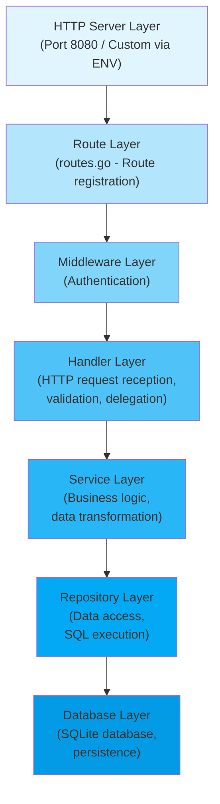
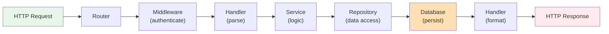
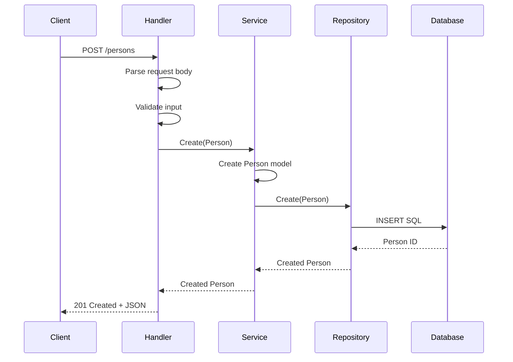
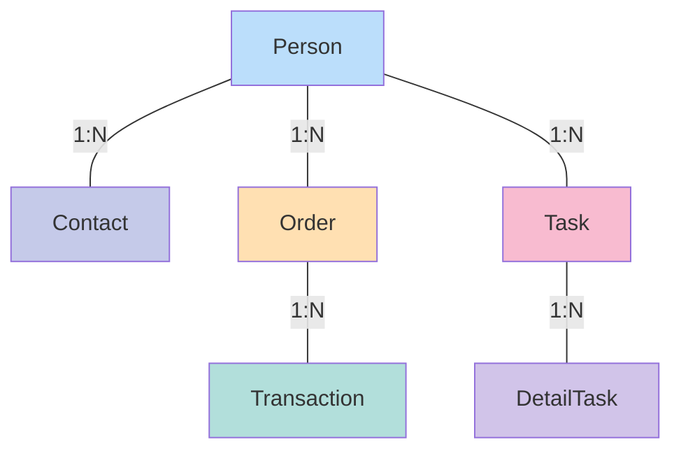
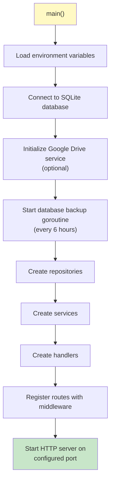
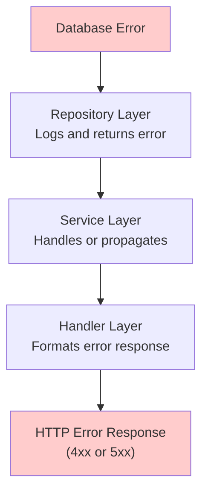

# Architecture Documentation

## Overview

The Service Order API is built using a layered architecture pattern that separates concerns across multiple layers. This design ensures:

- Maintainability - Changes in one layer do not affect others
- Testability - Each layer can be tested independently
- Scalability - Easy to extend with new features
- Reusability - Components can be reused across different parts

## Architectural Layers



## Layer Responsibilities

### 1. Route Layer (internal/routes/routes.go)

Responsibility: Register HTTP routes and map them to handlers

Key Components:
- RegisterPersonRoutes - Person endpoints
- RegisterContactRoutes - Contact endpoints
- RegisterOrderRoutes - Order endpoints
- RegisterTaskRoutes - Task endpoints
- RegisterTransactionRoutes - Transaction endpoints
- RegisterDetailTaskRoutes - Detail task endpoints
- RegisterHealthRoutes - Health check endpoint

Pattern:
```go
func RegisterPersonRoutes(r chi.Router, handler *handlers.PersonHandler) {
    r.Route("/persons", func(r chi.Router) {
        r.Use(middlewares.InternalAuthMiddleware)
        r.Post("/", handler.Create)
        r.Get("/", handler.Index)
        r.Route("/{id}", func(r chi.Router) {
            r.Get("/", handler.GetByID)
            r.Put("/", handler.Replace)
            r.Patch("/", handler.Update)
            r.Delete("/", handler.Delete)
        })
    })
}
```

### 2. Middleware Layer (internal/middlewares/)

Responsibility: Cross-cutting concerns applied to requests

Current Middleware:
- InternalAuthMiddleware - Validates internal API token

Pattern:
- Applied at route registration level
- Validates requests before reaching handlers
- Returns error responses if validation fails

### 3. Handler Layer (internal/handlers/)

Responsibility: Handle HTTP requests and orchestrate the response

Handler Types:
- PersonHandler
- ContactHandler
- OrderHandler
- TaskHandler
- TransactionHandler
- DetailTaskHandler

Handler Methods (CRUD):
- Create(w, r) - POST request, create new entity
- Index(w, r) - GET request, list all entities
- GetByID(w, r) - GET request, retrieve single entity
- Replace(w, r) - PUT request, replace entire entity
- Update(w, r) - PATCH request, update specific fields
- Delete(w, r) - DELETE request, remove entity

Responsibilities:
1. Parse and validate incoming requests
2. Call appropriate service methods
3. Handle errors and format responses
4. Return HTTP status codes and JSON

### 4. Service Layer (internal/services/)

Responsibility: Implement business logic and rules

Services:
- PersonService
- ContactService
- OrderService
- TaskService
- TransactionService
- DetailTaskService

Responsibilities:
1. Business logic implementation
2. Data transformation
3. Cross-entity operations
4. Validation rules enforcement
5. Dependency coordination

Example Flow:
```
ContactService.Create(contact)
├── Validate contact data
├── Check person exists (via PersonRepository)
├── Call ContactRepository.Create()
└── Return created contact
```

### 5. Repository Layer (internal/repositories/)

Responsibility: Abstract data access and database operations

Repositories:
- PersonRepository
- ContactRepository
- OrderRepository
- TaskRepository
- TransactionRepository
- DetailTaskRepository

CRUD Methods:
- Create(entity) - Insert new record
- GetAll() - Retrieve all records
- GetByID(id) - Retrieve single record
- Update(entity) - Update existing record
- Delete(id) - Delete record

Responsibilities:
1. Execute SQL queries
2. Handle database errors
3. Map database rows to models
4. Provide query abstraction

### 6. Model Layer (internal/models/)

Responsibility: Define data structures

Models:

#### Person
```go
type Person struct {
    ID         uint64
    FirstName  string
    MiddleName *string
    LastName   *string
    CreatedAt  time.Time
}
```

#### Order
```go
type Order struct {
    ID           uint64
    Status       OrderStatus
    OrderDate    time.Time
    LastModified time.Time
    TotalPrice   uint64
    PersonID     *uint64
}
```

#### Contact
- Links to Person
- Stores contact information

#### Task
- Independent work items
- Linked to orders

#### Transaction
- Financial records
- Linked to orders

#### DetailTask
- Granular task details
- Linked to tasks

### 7. Database Layer (internal/database/)

Components:
- sqlite.go - Database connection and initialization
- schema.sql - Table definitions

Features:
- SQLite embedded database
- Automatic schema creation
- Connection pooling
- Google Drive backup integration

## Data Flow

### Request Processing Flow



### Example: Create Person



## Design Patterns Used

### 1. Repository Pattern
Abstracts data access logic, allowing easy testing and switching databases.

```go
type PersonRepository interface {
    Create(person *Person) error
    GetByID(id uint64) (*Person, error)
    GetAll() ([]*Person, error)
    Update(person *Person) error
    Delete(id uint64) error
}
```

### 2. Service Layer Pattern
Encapsulates business logic separate from HTTP concerns.

```go
type PersonService struct {
    repo PersonRepository
}

func (s *PersonService) Create(person *Person) error {
    // Business logic here
    return s.repo.Create(person)
}
```

### 3. Dependency Injection
Components receive dependencies through constructors.

```go
func main() {
    personRepo := repositories.NewPersonRepository(db)
    personService := services.NewPersonService(personRepo)
    personHandler := handlers.NewPersonHandler(personService)
}
```

### 4. Middleware Pattern
Cross-cutting concerns applied to request pipeline.

```go
r.Use(middlewares.InternalAuthMiddleware)
r.Post("/", handler.Create)
```

### 5. Factory Pattern
Constructor functions create and initialize components.

```go
func NewPersonHandler(service *PersonService) *PersonHandler {
    return &PersonHandler{service: service}
}
```

## Entity Relationships



## Configuration & Startup Flow



## Error Handling

Errors propagate up through layers:



## Scalability Considerations

### Current State
- Single-server deployment
- Embedded SQLite database
- In-memory data processing

### Future Improvements
1. Database - Migrate to PostgreSQL for multi-server support
2. Caching - Add Redis for performance
3. Message Queue - Add message queue for async operations
4. Monitoring - Add metrics and logging
5. API Gateway - Add reverse proxy for routing
6. Service Discovery - For microservices architecture

## Performance Characteristics

- Request Handling: Sub-millisecond route dispatch
- Database: SQLite suitable for up to 100k daily transactions
- Memory: Minimal footprint for CRUD operations
- Backup: Non-blocking Google Drive backup every 6 hours

## Security Architecture

### Authentication
- Internal API token validation
- Hash-based token comparison
- Token required for all endpoints except /health

### Input Validation
- Handler-level input validation
- Type checking via Go type system
- SQL parameterization prevents injection

### Data Protection
- Encrypted Google Drive backup
- Token environment variables (not in code)
- No sensitive data in logs

## Design Decisions

### Why Layered Architecture?
- Separation of concerns
- Easier testing of business logic
- Clear dependency flow
- Industry-standard pattern

### Why Repository Pattern?
- Decouples services from database details
- Easy to mock for testing
- Simple to switch databases

### Why Service Layer?
- Business logic centralized
- Reusable across handlers
- Testable independently

### Why Chi Router?
- Lightweight and fast
- Excellent middleware support
- Simple API
- Good performance

### Why SQLite?
- No server needed
- File-based backup capability
- Suitable for service order scale
- Easy development and testing

---

For implementation details, see specific files in internal/ directory.
